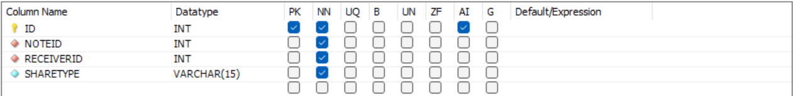

# NoteLite 
## Thông tin chung
* Nhóm: 23
* Chủ đề: Phầm mềm Note hỗ trợ học tập
* Author: Do Huy Dat, Vũ Mạnh Hưng, Nguyễn Huyền San, Nguyễn Thị Diệu Linh, Lê Minh Triết
## Mô tả ứng dụng
Ứng dụng desktop NoteLite hỗ trợ việc ghi chú để học tập, làm việc.
Ứng dụng được thiết kế theo mô hình Client-Server với một số điểm đặc biệt:
1. Đồng bộ dữ liệu giữa các máy với cùng một tài khoản.
2. Xuất, nhập dữ liệu với định dạng PDF.
3. Chia sẻ Note của mình với các tài khoản khác.
4. Giao diện đơn giản, thân thiện, cung cấp trải nghiệm cho người dùng
## Một số thông tin cài đặt về ứng dụng khi phát triển
1. Ngôn ngữ lập trình: Java (JDK 21), CSS.
2. IDE: Apache NetBeans IDE 21.
3. Hệ quản trị Cơ sở dữ liệu: MySQL Workbench 8.0 CE.
4. Hỗ trợ thiết kế GUI: JavaFX (SDK 21), Scene Builder.
5. Thiết lập server tạm thời để thử nghiệm: localhost.
## Hướng dẫn chạy thử
Để chạy thử code, cần
### Clone code từ GitHub
### Cài đặt các thư viện
Các thư viện cần thiết là các file jar đã được lưu ở [lib](lib/). 
Cần chú ý cài đặt 2 thư viện chính (thêm vào Library của Project):

* Thư viện phục vụ kết nối MySQL ([mysql-connector-j-8.3.0](lib/mysql-connector-j-8.3.0.jar))
* Thư viện phục vụ xuất, nhập dữ liệu từ PDF ([itextpdf-5.5.9](lib/itextpdf-5.5.9.jar))

Các thư viện khác thực chất là để chạy JavaFX, vì từ JDK 15 JavaFX được phát triển riêng. Nếu sử dụng JDK phiên bản 15 trở về trước thì không cần cài đặt các thư viện này.
### Restore và cài đặt CSDL
Có thể tạo một csdl mới, với tên `notelitedb` với 4 bảng và các thuộc tính lần lượt được cài đặt như sau

* Bảng `users`: 

* Bảng `notes`: 

* Bảng `sharenotes`:

* Bảng `note_filters`:

Hoặc, có thể restore csdl này từ các file json trong [jsondb](jsondb/), ví dụ minh họa bằng các bước sau

1. Tạo database mới mang tên `notelitedb`.
2. Click chuột phải vào database, chọn `Table Data Import Wizard`.

3. Chọn lần lượt file path dẫn tới các file json ở trên, chọn tạo bảng mới với tên tương ứng

Chú ý sau khi thiết lập CSDL, cần sửa các thuộc tính để kết nối tới CSDL một cách phù hợp bằng cách truy cập vào các thuộc tính của class [NetworkProperty](src/com/notelitemodel/NetworkProperty.java), đặc biệt là username, password để truy nhập CSDL MySQL.

### Chạy thử code
Sau khi đã setup mọi thứ phía trên
#### Chạy server trước 
Compile file [NoteLiteServer](src/com/noteliteserver/NoteLiteServer.java)
#### Chạy client sau
Compile file [NoteLite](src/com/noteliteclient/NoteLite.java)
